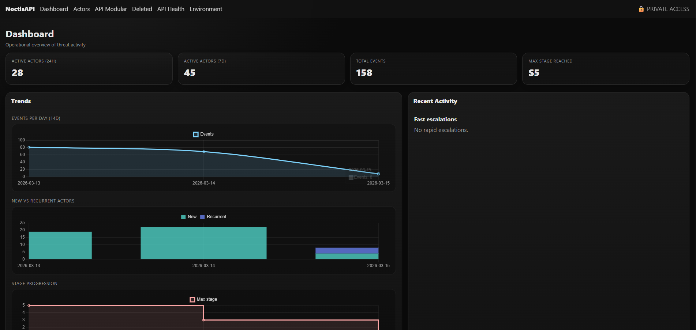
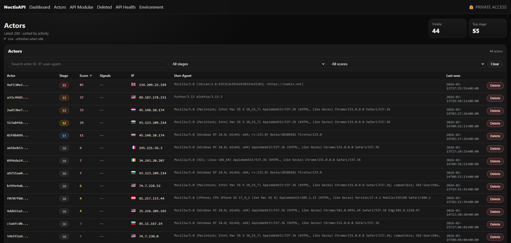
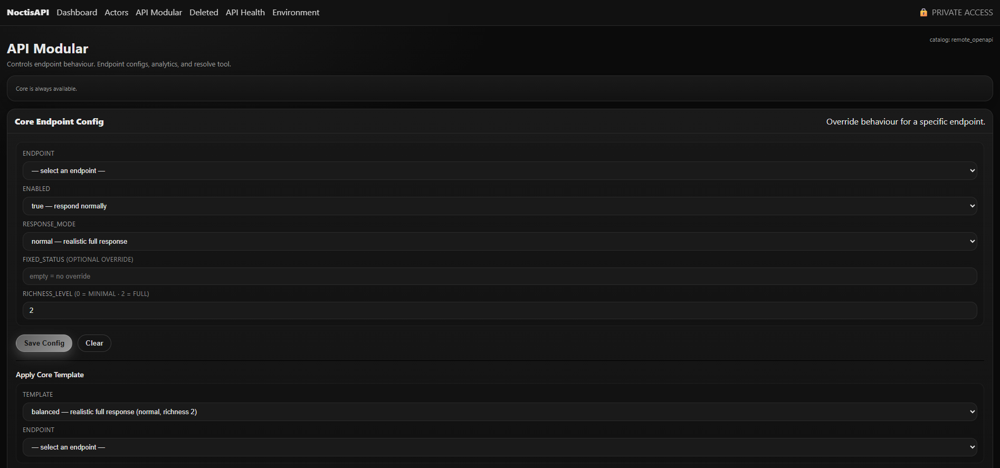
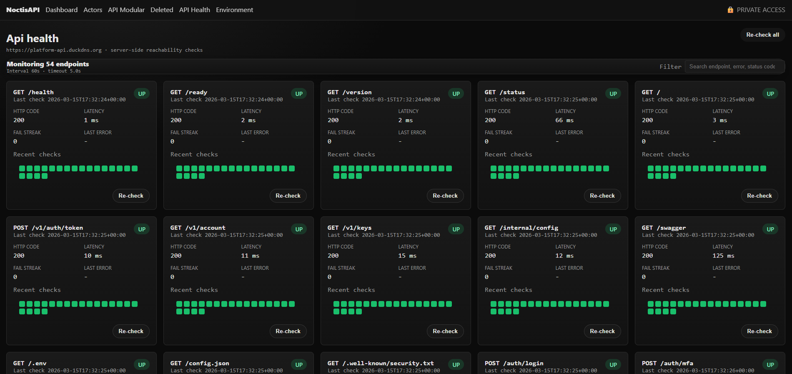

# NoctisAPI Core

**A honeypot API that looks real — and makes attackers believe it.**

Deploy a fake-but-convincing REST API surface. Every scanner, credential stuffer, and targeted attacker that hits it gets profiled, staged, and tracked. No agent. No code changes to your real infrastructure.

- One-command deploy with automatic TLS
- Actor profiling, session tracking, and behavioral scoring out of the box
- Apache-2.0 open source — **[PRO available](https://noctisapi.com)** with campaigns, cases, and smart deception

[](LICENSE)
&nbsp;
**[Quick Start](#quick-start)** · **[Features](#features)** · **[Get PRO →](https://noctisapi.com)**

---

## Preview

| Dashboard | Actors |
|---|---|
|  |  |

| API Config | API Health |
|---|---|
|  |  |

---

## What is this?

Most honeypots are either too simple (attackers ignore them) or too complex to deploy. NoctisAPI is a production-grade deception layer built as a realistic REST API — it mimics the shape of real services so automated tools and human attackers engage with it.

What you get:

- A **convincing fake API** with staged responses, consistent fake data, and realistic error behavior
- An **admin panel** that tracks every actor, session, and interaction in real time
- **Behavioral profiling** that scores and stages attackers as they progress through your surface
- A **Docker-first deploy** — domain + email is all you need to go live

You don't touch your real services. The honeypot sits alongside them.

---

## Features

### Core — this repo, free forever

| Feature | |
|---|---|
| Realistic honeypot API surface with staged responses | ✓ |
| Actor profiling + behavioral scoring | ✓ |
| Session tracking with stage progression | ✓ |
| Per-endpoint configuration (enabled, response mode, richness, status) | ✓ |
| Endpoint analytics + interest scoring | ✓ |
| API availability monitoring | ✓ |
| GeoIP enrichment via MaxMind GeoLite2 (optional, free) | ✓ |
| Structured request logging with actor ID, geo, UA | ✓ |
| Trusted proxy / Cloudflare IP resolution | ✓ |
| Bulk actor management (archive, delete, restore) | ✓ |
| Webhook alerts | ✓ |
| Docker + Traefik with automatic TLS | ✓ |

### PRO — [noctisapi.com](https://noctisapi.com)

| Feature | |
|---|---|
| **Cases workflow** — triage attacker activity into structured investigations | ✓ |
| **Campaigns explorer** — cluster actors by behavior, visualize attacker campaigns | ✓ |
| **Replay & evidence** — link session replays and events to cases | ✓ |
| **Advanced scoring** — extended behavioral heuristics | ✓ |
| **File upload simulation** — capture attacker-supplied payloads safely | ✓ |
| **API Mutation** — rotate responses over time to confuse automated scanners | ✓ |
| **Smart Rules** — conditional per-endpoint overrides by path, method, or user-agent | ✓ |

> PRO runs with offline license verification — no outbound calls after activation. Without a license, the instance runs Core mode with all PRO features disabled. [Get PRO →](https://noctisapi.com)

---

## Quick Start

### Production (one command)

```bash
bash setup.sh --domain api.example.com --email ops@example.com --yes
```

The script writes `.env.prod`, pulls the Docker image, starts the stack, and issues a TLS certificate automatically. Existing `.env.prod` is never overwritten — re-running is safe.

**Requirements:** Docker 20.10+ with Compose plugin · ports 80 and 443 open

### Manual setup

```bash
cp .env.prod.example .env.prod
# Edit .env.prod — only 3 values required:
#   HP_PUBLIC_HOST   your domain
#   ACME_EMAIL       Let's Encrypt email
#   HP_SEED          run: python -c "import secrets; print(secrets.token_hex(32))"

docker compose --env-file .env.prod -f compose/docker-compose.prod.yml up -d
```

### Local development

```bash
git clone https://github.com/0x-unkwn0wn/noctisapi-core
cd noctisapi-core
docker compose -f compose/docker-compose.dev.yml up --build
```

| Service | URL |
|---|---|
| Public API (Swagger) | `http://127.0.0.1:8000/docs` |
| Admin Panel | `http://127.0.0.1:9001` |

---

## Admin Panel Access

The admin panel is never exposed to the internet. Access it via SSH tunnel:

```bash
# From your local machine:
ssh -L 9001:127.0.0.1:9001 user@your-server

# Then open:
http://localhost:9001
```

---

## How It Works

```
Internet
    │
    ▼
Traefik :443  (TLS termination)
    │
    ├─▶  Public API    :8000  ← attacker-facing, mimics a real REST API
    │    (honeypot_public.py)
    │
    └─▶  Admin Panel   :9001  ← internal only, SSH tunnel
         (panel_mvp.py)
              │
              └─▶  SQLite (WAL)  /data/honeypot.db
```

The public API surface is fully synthetic. It returns consistent fake data, progresses attackers through stages (recon → credential stuffing → exploitation), and captures rich telemetry without ever executing anything.

---

## Configuration

Minimum required to deploy:

| Variable | Description |
|---|---|
| `HP_PUBLIC_HOST` | Your public domain (e.g. `api.example.com`) |
| `ACME_EMAIL` | Email for Let's Encrypt TLS |
| `HP_SEED` | Stable random secret — auto-generated by `setup.sh` |
| `DATABASE_URL` | SQLite path for Alembic migrations (set in the example) |

> **`HP_SEED` must never change after first run.** It derives all actor IDs — changing it invalidates your entire history.

Common optional settings:

| Variable | Description |
|---|---|
| `HP_ALERT_WEBHOOK_URL` | Slack/Discord webhook for high-signal alerts |
| `HP_ACTOR_UA_MODE` | Actor identity mode: `ip` (default) · `family` · `full` |
| `LOG_LEVEL` | `debug` · `info` (default) · `warning` |
| `MAXMIND_ACCOUNT_ID` + `MAXMIND_LICENSE_KEY` | Enable GeoIP (free account at maxmind.com) |

See [`.env.prod.example`](.env.prod.example) for all options.

---

## Upgrade to PRO

PRO adds the full investigation and deception toolkit: Cases, Campaigns, Replay, Smart Rules, API Mutation, and the file upload simulation pipeline.

**1. Get a license** at [noctisapi.com](https://noctisapi.com).

**2. Install PRO** — the PRO installer handles everything:

```bash
bash install.sh \
  --license /path/to/license.json \
  --domain  api.example.com \
  --email   ops@example.com \
  --yes
```

**3. Activate on an existing Core install:**

```bash
# Option A — admin panel: Settings → License → Upload license.json

# Option B — place the file directly and restart:
docker cp license.json <container>:/var/lib/myapp/license.json
docker compose restart app admin
```

PRO features activate immediately. No restart of the public API is needed unless you switch from Core to PRO for the first time.

---

## Maintenance

**Backups:**

```bash
bash backup_sqlite.sh    # writes to ./backups/

# Automate daily via cron:
cp ops/cron/yourapp-backup /etc/cron.d/yourapp-backup
```

**Data retention** (prune old rows):

```bash
# Dry run:
docker exec <app-container> python scripts/prune_retention.py --db /data/honeypot.db --dry-run

# Apply:
docker exec <app-container> python scripts/prune_retention.py --db /data/honeypot.db
```

Defaults: events 30d · sessions 30d · tokens 90d. All configurable via env vars.

**Updates:**

```bash
docker compose --env-file .env.prod -f compose/docker-compose.prod.yml pull
docker compose --env-file .env.prod -f compose/docker-compose.prod.yml up -d
```

---

## FAQ

**Is this safe to expose to the internet?**
Yes. The public API is entirely synthetic — it never executes attacker-supplied input. The admin panel is bound to `127.0.0.1` only and requires an SSH tunnel to access.

**Will attackers know it's a honeypot?**
The API mimics real service behavior with staged responses, consistent fake data, and realistic error codes. Nothing in the responses indicates it is a honeypot.

**Can I use it without a public domain / Traefik?**
Yes — the dev compose runs without Traefik or TLS. For internal use you can also run the prod compose without DNS by pointing directly to the server IP and disabling ACME.

**What happens if I change `HP_SEED`?**
All existing actor IDs are invalidated. The data remains in the database but actors will be unlinked from their sessions and events. Don't change it after first run.

**Does Core phone home or collect telemetry?**
No. Core is fully self-contained. No outbound calls are made.

**What does PRO add that justifies the cost?**
The Core is a solid detection layer. PRO turns detections into actionable intelligence: you can triage attackers into cases, identify campaign patterns across actors, attach evidence, and apply dynamic deception rules. If you're running this in a serious security context, PRO removes the manual work. [Compare features →](https://noctisapi.com)

---

## Contributing

Bug reports, feature requests, and pull requests are welcome.

- Open issues at [github.com/0x-unkwn0wn/noctisapi-core/issues](https://github.com/0x-unkwn0wn/noctisapi-core/issues)
- For questions or security reports: see [noctisapi.com](https://noctisapi.com)

---

## License

[Apache-2.0](LICENSE)

PRO features require a separate paid license. See [noctisapi.com](https://noctisapi.com).
